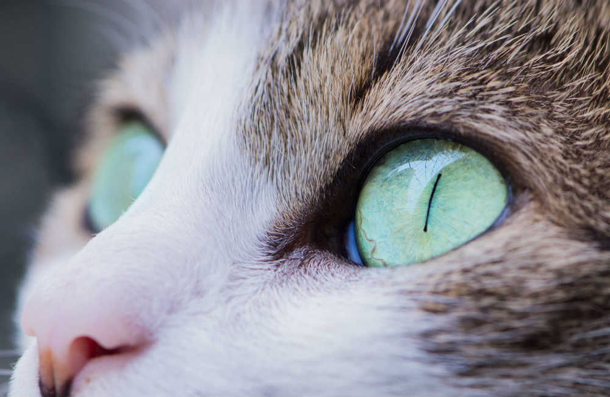

---?image=assets/img/stormtrooper-on-sand.jpg

## GitPitch Image Magic

#### A Quick Feature Tour

---?image=assets/img/stormtrooper-on-sand.jpg&opacity=40

### Apply Opacity masks to any background image
#### This helps to make your text stand out

---?image=assets/img/giraffes.jpg

### Start with fullscreen background images

---?image=assets/img/giraffes.jpg&size=auto 50%&color=#CCDAE7

### Size and scale to fit your needs

---?image=assets/img/giraffes.jpg&size=auto 50%&position=bottom&color=#CCDAE7

### Then position images wherever you need them on your slides

---?image=assets/img/monkey.jpg&size=50% 100%&color=lightgray&opacity=100

### Handle image aspect ratios that differ from your slideshow

---?image=assets/img/ballerina.jpg&size=auto 75%&position=bottom&color=#b7410e

### @color[white](Fill the background with custom colors for visual pop)

---?color=black

### @color[white](Layout images side-by-side)

@div[left-50]
  

@divend

@div[right-50]
  

@divend

---?color=black

### @color[white](Layout text alongside images)

@div[left-50]
 

@divend

@div[right-50]
   
@ul[brighten]
- Present
- Your
- Ideas
- Step-by-step
@ulend
@2divend

---?image=assets/img/face.jpg&size=auto 60%&repeat=repeat-x&color=black

### @color[white](Repeat background images)

---?color=black

### @color[white](Even present images step-by-step)

@div[left-50 fragment]

@divend

@div[right-50 fragment]

@divend

---?image=assets/img/stormtroopers.jpg

### No apologies needed.
### Just Markdown Image Magic.

---?color=black

  

## @color[white](Image Magic)
## @color[#e49436](From GitPitch with @fa[heart])

 

#### View the [presentation markdown](https://github.com/gitpitch/feature-demo/blob/image-magic/PITCHME.md).

@size[0.5em](Please remember to <a href="http://tinypng.com">size optimize</a> your slideshow images for use on the Web.)

