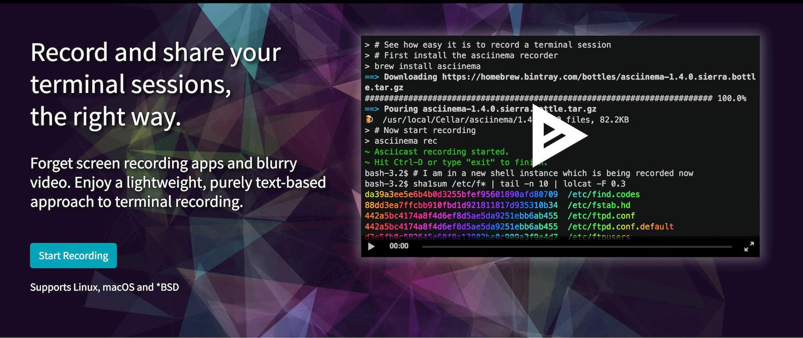

@snap[north span-100]
### GitPitch Pro Terminal Sessions
@snapend

@snap[midpoint span-100]

@snapend

@snap[south text-06 text-gray span-100]
Online and offline session playback powered by [Asciinema](https://asciinema.org)
@snapend

---?terminal=sessions/wordpress.json&color=#7FDBFF&font=small&title=WordPress Backup Demo

---?terminal=sessions/wordpress.json&poster=npt:1:33&color=orange

---?terminal=sessions/trino.json&font=16px&theme=monokai&poster=npt:0:37&color=#DDDDDD

---

### Learn By Example
#### View The <a target="_blank" href="https://github.com/gitpitch/feature-demo/blob/pro-terminal-sessions/PITCHME.md">Presentation Markdown</a>

@snap[south text-06 text-gray span-100]
For further details, see the [GitPitch Docs](https://gitpitch.com/docs/code-features/terminal-sessions).
@snapend

